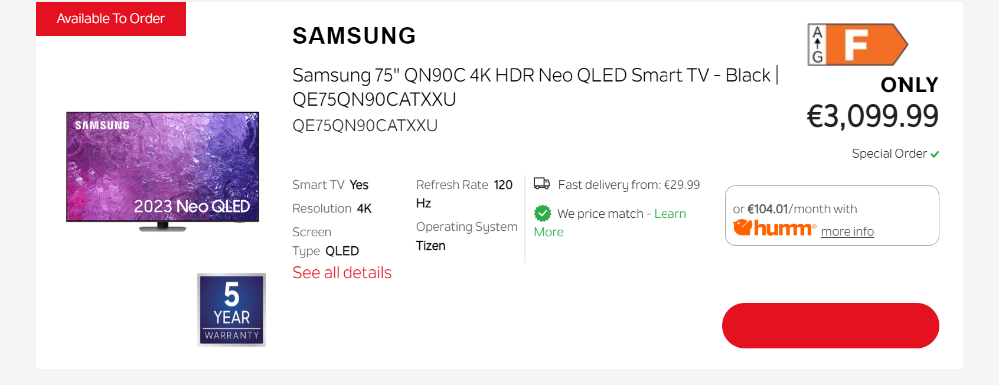
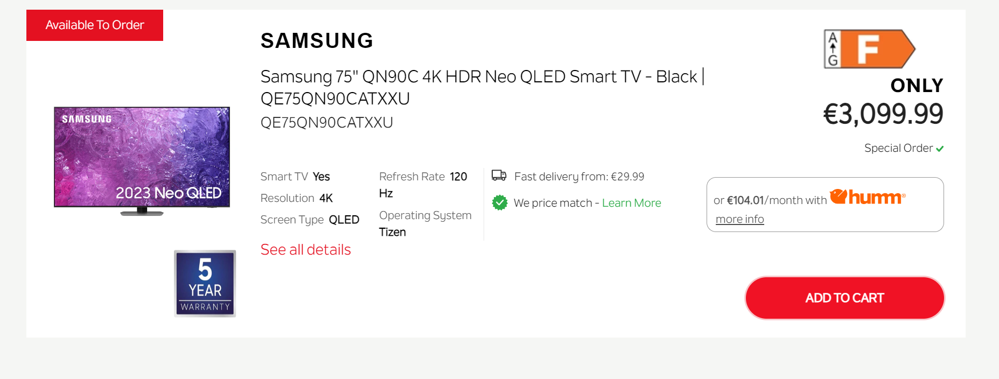

# DID.ie Website Fix

This repository contains a fix for the hover and active states of the "Add to Cart" button while using the search function on the DID.ie website. The issue was that the text turned red on hover and click, blending with the button's background and making it unreadable.

## Problem Description

On hovering over or focus clicking the "Add to Cart" button, the text color changed to red, causing the text to be invisible.


## Before

Before Fix Screenshot:



## After

After Fix Screenshot:


## Solution

The CSS was modified to ensure better contrast and visibility:
- Ensured the text color remains white for better readability.

### CSS Code

```css
.special_order_btn:hover {
    color: white;
}

.special_order_btn:focus {
    color: white;
}
